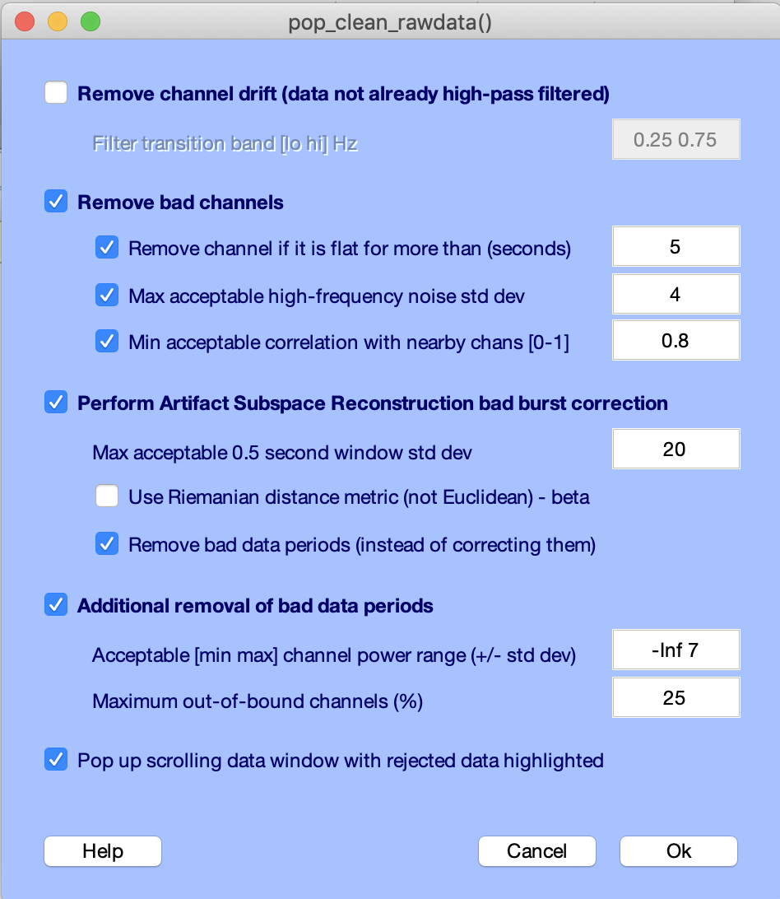

# Clean_rawdata EEGLAB plug-in

The Clean Rawdata plug-in (version 2.0) interface has been redesigned and will soon become the default EEGLAB method for removing artifacts from EEG and related data. The plug-in detects and can separate low-frequency drifts, flatline and noisy channels from the data. It can also apply ASR (automated subspace removal) to detect and reject or remove high-amplitude non-brain ('artifact') activity (produced by eye blinks, muscle activity, sensor motion, etc.) by comparing its structure to that of known artifact-free reference data, thereby revealing and recovering (possibly smaller) EEG background activity that lies outside the subspace spanned by the artifact processes.

**Note:** This plug-in uses the Signal Processing toolbox for pre- and post-processing of the data (removing drifts, channels and time windows); the core ASR method (clean_asr) does not require this toolbox but you will need high-pass filtered data if you use it directly.

# This project needs you

We need community maintain to this project. Please review existing issues and issue pull requests. A section in this documentation with link to all the existing methodological papers is also needed.

# Credit

This plug-in, clean_rawdata uses methods (e.g., Artifact Subspace 
Reconstruction, ASR) by Christian Kothe from the BCILAB Toolbox 
(Kothe & Makeig, 2013), first wrapped into an EEGLAB plug-in by 
Makoto Miyakoshi and further developed by Arnaud Delorme with 
Scott Makeig.

This plug-in cleans raw EEG data. Methods from the BCILAB toolbox
are being used (in particular Artifact Subspace Reconstruction)
designed by Christian Kothe.

These functions were wrapped up into an EEGLAB plug-in by Makoto
Myakoshi, then later by Arnaud Delorme with input from Scott
Makeig.

The private folder contains 3rd party utilities, including:
- findjobj.m Copyright (C) 2007-2010 Yair M. Altman
- asr_calibrate.m and asr_process.m
 Copyright (C) 2013 The Regents of the University of California
 Note that this function is not free for commercial use.
- sperhicalSplineInterpolate.m Copyright (C) 2009 Jason Farquhar
- oct_fftfilt Copyright (C) 1996, 1997 John W. Eaton
- utility functions from the BCILAB toolbox Copyright (C) 2010-2014 Christian Kothe

The folder "manopt" contains the Matlab toolbox for optimization on manifolds.

# Graphic interface

Below we detail the GUI interface. Individual function contain additional help information.

## High pass filter the data

Check checkbox **(1)** if the data have not been high pass filtered yet. If you use this option, the edit box in **(2)** allows setting the transition band for the high-pass filter in Hz. This is formatted as[transition-start, transition-end]. Default is 0.25 to 0.75 Hz.

## Reject bad channels

Check checkbox **(3)** to reject bad channels. Options **(4)** allows removal of flat channels. The edit box sets the maximum tolerated (non-rejected) flatline duration in seconds. If a channel has a longer flatline than this, it will be considered abnormal and rejected. The default is 5 seconds. Option **(5)** sets the Line Noise criterion: If a channel has more line noise relative to its signal than this value (in standard deviations based on the total channel signal), it is considered abnormal. The default is 4 standard deviations. Option **(6)** sets the minimum channel correlation. If a channel is correlated at less than this value to an estimate based on other nearby channels, it is considered abnormal in the given time window. This method requires that channel locations be available and roughly correct; otherwise a fallback criterion will be used. The default is a correlation of 0.8.

## Artifact Subspace Reconstruction

Check checkbox **(7)** to use Artifact Subspace Reconstruction (ASR). ASR is described in this [publication](https://www.ncbi.nlm.nih.gov/pubmed/26415149). In edit box **(8)** you may change the standard deviation cutoff for removal of bursts (via ASR). Data portions whose variance is larger than this threshold relative to the calibration data are considered missing data and will be removed. The most aggressive value that can be used without losing much EEG is 3. For new users it is recommended to first visually inspect the difference between the aw and the cleaned data (using eegplot) to get a sense of the content the is removed at various levels of this input variable. Here, a quite conservative value is 20; this is the current default value. Use edit box **(9)** to use Riemannian distance instead of Euclidian distance. This is a beta option as the advantage of this method has not yet been clearly demonstrated. Checkbox **(10)** allows removal instead of correction of artifact-laden portions of data identified by ASR. One of the strength of ASR is its ability to detect stretches of 'bad data' before correcting them. This option allows use of ASR for data-period rejection instead of correction, and is the default for offline data processing. ASR was originally designed as an online data cleaning algorithm, in which case 'bad data' correction may be used.

## Additional removal of 'bad data' periods

Check checkbox **(11)** to perform additional removal of bad-data periods. Edit box **(12)** sets the maximum percentage of contaminated channels that are tolerated in the final output data for each considered window. Edit box **(13)** sets the noise threshold for labeling a channel as contaminated.

## Display rejected and corrected regions

Check checkbox **(14)** plots rejection results overlaid on the original data. This option is useful to visually assess the performance of a given ASR method.

Additional parameters are accessible through the command line interface of the clean_artifacts function.

## Additional documentation

Makoto Miyakoshi wrote a page in the [wiki section](https://github.com/sccn/clean_rawdata/wiki) of this repository discussing ASR.

# Version history
v0.34 and earlier - original versions

v1.0 - new default values for some of the rejection tools, new GUI

v2.0 - new improved GUI, compatibility with studies

v2.1 - fix issue with 'distance' variable for burst detection

v2.2 - fix history call for pop_clean_rawdata

v2.3 - add maxmem to asr_calibrate to ensure reproducibility of results

v2.4 - fixing issue with running function in parallel for Matlab 2020a

v2.5 - move asr_calibrate out of the private folder so it can be used directly

v2.6 - allowing to exclude channels and a variety of small bug fixes

v2.7 - allowing to fuse channel rejection for datasets with same subject and session (STUDY processing)
